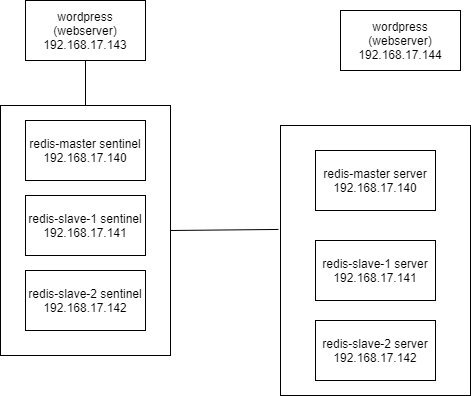

# bdt_redis

## Gambar Arsitektur



## Spesifikasi Node Redis

1. Redis Server:
- redismaster --> OS : bento/ubuntu-18.04, RAM : 512 MB, IP : **192.168.17.140**
- redisslave1 --> OS : bento/ubuntu-18.04, RAM : 512 MB, IP : **192.168.17.141**
- redisslave2 --> OS : bento/ubuntu-18.04, RAM : 512 MB, IP : **192.168.16.142**

2. Wordpress Server (webserver) + MySQL:
- wordpress1 --> OS : bento/ubuntu-18.04, RAM : 512 MB, IP : **192.168.17.143**
- wordpress2 --> OS : bento/ubuntu-18.04, RAM : 512 MB, IP : **192.168.16.144**

## Mengkonfigurasi Vagrantfile

<h4>1. Vagrantfile</h4> 

```
Vagrant.configure("2") do |config|

  config.vm.define "redismaster" do |node|
    node.vm.hostname = "redismaster"
    node.vm.box = "bento/ubuntu-18.04"
    node.vm.network "private_network", ip: "192.168.17.140"

    node.vm.provider "virtualbox" do |vb|
      vb.name = "redismaster"
      vb.gui = false
      vb.memory = "512"
    end

    node.vm.provision "shell", path: "provision/redismaster.sh", privileged: false
  end

  (1..2).each do |i|
    config.vm.define "redisslave#{i}" do |node|
      node.vm.hostname = "redisslave#{i}"
      node.vm.box = "bento/ubuntu-18.04"
      node.vm.network "private_network", ip: "192.168.17.#{140+i}"

      node.vm.provider "virtualbox" do |vb|
        vb.name = "redisslave#{i}"
        vb.gui = false
        vb.memory = "512"
      end

      node.vm.provision "shell", path: "provision/redisslave#{i}.sh", privileged: false
    end
  end

  (1..2).each do |i|
    config.vm.define "wordpress#{i}" do |node|
      node.vm.hostname = "wordpress#{i}"
      node.vm.box = "bento/ubuntu-18.04"
      node.vm.network "private_network", ip: "192.168.17.#{142+i}"

      node.vm.provider "virtualbox" do |vb|
        vb.name = "wordpress#{i}"
        vb.gui = false
        vb.memory = "512"
      end

      node.vm.provision "shell", path: "provision/wordpress.sh", privileged: false
    end
  end

end
```

<h4>2. File Provision (.sh)</h4>

- **redismaster.sh**

```
sudo cp /vagrant/sources/hosts /etc/hosts
sudo cp '/vagrant/sources/sources.list' '/etc/apt/'

sudo apt update -y

sudo apt-get install redis -y

sudo cp /vagrant/config/redis-master.conf /etc/redis/redis.conf
sudo cp /vagrant/config/sentinel-master.conf /etc/redis-sentinel.conf
```

- **redisslave1.sh**

```
sudo cp /vagrant/sources/hosts /etc/hosts
sudo cp '/vagrant/sources/sources.list' '/etc/apt/'

sudo apt update -y

sudo apt-get install redis -y

sudo cp /vagrant/config/redis-slave-1.conf /etc/redis/redis.conf
sudo cp /vagrant/config/sentinel-slave-1.conf /etc/redis-sentinel.conf
```

- **redisslave2.sh**

```
sudo cp /vagrant/sources/hosts /etc/hosts
sudo cp '/vagrant/sources/sources.list' '/etc/apt/'

sudo apt update -y

sudo apt-get install redis -y

sudo cp /vagrant/config/redis-slave-2.conf /etc/redis/redis.conf
sudo cp /vagrant/config/sentinel-slave-2.conf /etc/redis-sentinel.conf
```

- **wordpress.sh**

```
sudo cp '/vagrant/sources/sources.list' '/etc/apt/'

sudo apt update -y

# Install Apache2
sudo apt install apache2 -y
sudo ufw allow in "Apache Full"

# Install PHP
sudo apt install php libapache2-mod-php php-mysql php-pear php-dev -y
sudo a2enmod mpm_prefork && sudo a2enmod php7.0
sudo pecl install redis
sudo echo 'extension=redis.so' >> /etc/php/7.2/apache2/php.ini

# Install MySQL
sudo debconf-set-selections <<< 'mysql-server mysql-server/root_password password admin'
sudo debconf-set-selections <<< 'mysql-server mysql-server/root_password_again password admin'
sudo apt install mysql-server -y
sudo mysql_secure_installation -y
sudo ufw allow 3306

# Configure MySQL for Wordpress
sudo mysql -u root -padmin < /vagrant/config/wordpress.sql

# Install Wordpress
cd /tmp
wget -c http://wordpress.org/latest.tar.gz
tar -xzvf latest.tar.gz
sudo mkdir -p /var/www/html
sudo mv wordpress/* /var/www/html
sudo cp /vagrant/config/wp-config.php /var/www/html/
sudo chown -R www-data:www-data /var/www/html/
sudo chmod -R 755 /var/www/html/
sudo systemctl restart apache2
```

<h4>3. File Konfigurasi (.conf)</h4>

- **redis-master.conf**

```
bind 192.168.17.140
port 6379

dir "/etc/redis"
```

- **redis-slave-1.conf**

```
bind 192.168.17.141
port 6379

dir "/etc/redis"

slaveof 192.168.17.140 6379
```

- **redis-slave-2.conf**

```
bind 192.168.17.142
port 6379

dir "/etc/redis"

slaveof 192.168.17.140 6379
```

- **sentinel-master.conf**

```
bind 192.168.17.140
port 26379

sentinel monitor redis-cluster 192.168.17.140 6379 2
sentinel down-after-milliseconds redis-cluster 5000
sentinel parallel-syncs redis-cluster 1
sentinel failover-timeout redis-cluster 10000
```

- **sentinel-slave-1.conf**

```
bind 192.168.17.141
port 26379

sentinel monitor redis-cluster 192.168.17.140 6379 2
sentinel down-after-milliseconds redis-cluster 5000
sentinel parallel-syncs redis-cluster 1
sentinel failover-timeout redis-cluster 10000
```

- **sentinel-slave-2.conf**

```
bind 192.168.17.142
port 26379

sentinel monitor redis-cluster 192.168.17.140 6379 2
sentinel down-after-milliseconds redis-cluster 5000
sentinel parallel-syncs redis-cluster 1
sentinel failover-timeout redis-cluster 10000
```

<h4>4. File Tambahan</h4>

- **hosts**

```
192.168.17.140 redis-master
192.168.17.141 redis-slave-1
192.168.17.142 redis-slave-2
192.168.17.143 wordpress-1
192.168.17.144 wordpress-2
```

- **sources.list**

```
## Note, this file is written by cloud-init on first boot of an instance
## modifications made here will not survive a re-bundle.
## if you wish to make changes you can:
## a.) add 'apt_preserve_sources_list: true' to /etc/cloud/cloud.cfg
##     or do the same in user-data
## b.) add sources in /etc/apt/sources.list.d
## c.) make changes to template file /etc/cloud/templates/sources.list.tmpl

# See http://help.ubuntu.com/community/UpgradeNotes for how to upgrade to
# newer versions of the distribution.
# deb http://archive.ubuntu.com/ubuntu bionic main restricted
# deb-src http://archive.ubuntu.com/ubuntu bionic main restricted

deb http://boyo.its.ac.id/ubuntu bionic main restricted

## Major bug fix updates produced after the final release of the
## distribution.
# deb http://archive.ubuntu.com/ubuntu bionic-updates main restricted
# deb-src http://archive.ubuntu.com/ubuntu bionic-updates main restricted

deb http://boyo.its.ac.id/ubuntu bionic-updates main restricted

## N.B. software from this repository is ENTIRELY UNSUPPORTED by the Ubuntu
## team. Also, please note that software in universe WILL NOT receive any
## review or updates from the Ubuntu security team.
# deb http://archive.ubuntu.com/ubuntu bionic universe
# deb-src http://archive.ubuntu.com/ubuntu bionic universe
# deb http://archive.ubuntu.com/ubuntu bionic-updates universe
# deb-src http://archive.ubuntu.com/ubuntu bionic-updates universe

deb http://boyo.its.ac.id/ubuntu bionic universe
deb http://boyo.its.ac.id/ubuntu bionic-updates universe

## N.B. software from this repository is ENTIRELY UNSUPPORTED by the Ubuntu
## team, and may not be under a free licence. Please satisfy yourself as to
## your rights to use the software. Also, please note that software in
## multiverse WILL NOT receive any review or updates from the Ubuntu
## security team.
# deb http://archive.ubuntu.com/ubuntu bionic multiverse
# deb-src http://archive.ubuntu.com/ubuntu bionic multiverse
# deb http://archive.ubuntu.com/ubuntu bionic-updates multiverse
# deb-src http://archive.ubuntu.com/ubuntu bionic-updates multiverse

deb http://boyo.its.ac.id/ubuntu bionic multiverse
deb http://boyo.its.ac.id/ubuntu bionic-updates multiverse

## N.B. software from this repository may not have been tested as
## extensively as that contained in the main release, although it includes
## newer versions of some applications which may provide useful features.
## Also, please note that software in backports WILL NOT receive any review
## or updates from the Ubuntu security team.
# deb http://archive.ubuntu.com/ubuntu bionic-backports main restricted universe multiverse
# deb-src http://archive.ubuntu.com/ubuntu bionic-backports main restricted universe multiverse

deb http://boyo.its.ac.id/ubuntu bionic-backports main restricted universe multiverse

## Uncomment the following two lines to add software from Canonical's
## 'partner' repository.
## This software is not part of Ubuntu, but is offered by Canonical and the
## respective vendors as a service to Ubuntu users.
# deb http://archive.canonical.com/ubuntu bionic partner
# deb-src http://archive.canonical.com/ubuntu bionic partner

# deb http://security.ubuntu.com/ubuntu bionic-security main restricted
# deb-src http://security.ubuntu.com/ubuntu bionic-security main restricted
# deb http://security.ubuntu.com/ubuntu bionic-security universe
# deb-src http://security.ubuntu.com/ubuntu bionic-security universe
# deb http://security.ubuntu.com/ubuntu bionic-security multiverse
# deb-src http://security.ubuntu.com/ubuntu bionic-security multiverse

deb http://boyo.its.ac.id/ubuntu bionic-security main restricted
deb http://boyo.its.ac.id/ubuntu bionic-security universe
deb http://boyo.its.ac.id/ubuntu bionic-security multiverse
```

- **wordpress.sql**

```
CREATE DATABASE wordpress DEFAULT CHARACTER SET utf8 COLLATE utf8_unicode_ci;

CREATE USER 'user'@'%' IDENTIFIED BY 'password';
GRANT ALL PRIVILEGES on wordpress.* to 'user'@'%';
FLUSH PRIVILEGES;
```

- **wp-config.php**

```
<?php
 /**
  * The base configuration for WordPress
  *
  * The wp-config.php creation script uses this file during the
  * installation. You don't have to use the web site, you can
  * copy this file to "wp-config.php" and fill in the values.
  *
  * This file contains the following configurations:
  *
  * * MySQL settings
  * * Secret keys
  * * Database table prefix
  * * ABSPATH
  *
  * @link https://codex.wordpress.org/Editing_wp-config.php
  *
  * @package WordPress
  */
 // ** MySQL settings - You can get this info from your web host ** //
 /** The name of the database for WordPress */
 define('DB_NAME', 'wordpress');
 /** MySQL database username */
 define('DB_USER', 'user');
 /** MySQL database password */
 define('DB_PASSWORD', 'password');
 /** MySQL hostname */
 define('DB_HOST', 'localhost:3306');
 /** Database Charset to use in creating database tables. */
 define('DB_CHARSET', 'utf8');
 /** The Database Collate type. Don't change this if in doubt. */
 define('DB_COLLATE', '');
 /**#@+
  * Authentication Unique Keys and Salts.
  *
  * Change these to different unique phrases!
  * You can generate these using the {@link https://api.wordpress.org/secret-key/1.1/salt/ WordPress.org secret-key service}
  * You can change these at any point in time to invalidate all existing cookies. This will force all users to have to log in again.
  *
  * @since 2.6.0
  */
 define('AUTH_KEY',         'bdt redis');
 define('SECURE_AUTH_KEY',  'bdt redis');
 define('LOGGED_IN_KEY',    'bdt redis');
 define('NONCE_KEY',        'bdt redis');
 define('AUTH_SALT',        'bdt redis');
 define('SECURE_AUTH_SALT', 'bdt redis');
 define('LOGGED_IN_SALT',   'bdt redis');
 define('NONCE_SALT',       'bdt redis');
 /**#@-*/
 /**
  * WordPress Database Table prefix.
  *
  * You can have multiple installations in one database if you give each
  * a unique prefix. Only numbers, letters, and underscores please!
  */
 $table_prefix  = 'wp_';
 /**
  * For developers: WordPress debugging mode.
  *
  * Change this to true to enable the display of notices during development.
  * It is strongly recommended that plugin and theme developers use WP_DEBUG
  * in their development environments.
  *
  * For information on other constants that can be used for debugging,
  * visit the Codex.
  *
  * @link https://codex.wordpress.org/Debugging_in_WordPress
  */
 define('WP_DEBUG', false);
 /* That's all, stop editing! Happy blogging. */
 /** Absolute path to the WordPress directory. */
 if ( !defined('ABSPATH') )
     define('ABSPATH', dirname(__FILE__) . '/');
 /** Sets up WordPress vars and included files. */
 require_once(ABSPATH . 'wp-settings.php');
```
